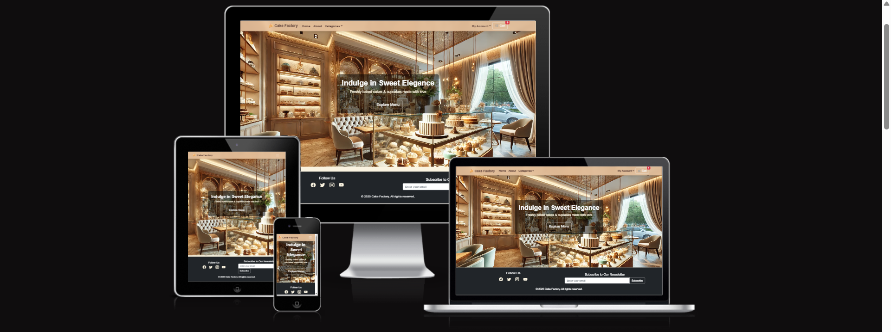

# 🎂 Cake Factory - E-commerce Project 🍰

## 🚀 Live Project
🔗 **Cake Factory on Heroku**: [Cake Factory](https://cake-factory-65cd55cbb35d.herokuapp.com/)

---



Cake Factory is an **elegant e-commerce platform** built using **Django**. Customers can **browse, order, and purchase** custom cakes and cupcakes for special occasions. The platform integrates **Stripe** for secure payments, offers **custom cake ordering**, and includes **marketing features** like newsletters and a Facebook Business Page.

This project was developed as part of a **Full-Stack Web Development course**, ensuring it meets industry standards in **security, UX, and functionality**.

## [Features](#features-1)
* ### [MainPage](#main-page)
  * #### [MainPageDelas](#main-page-offer-section)
  * #### [MainPageLocation](#main-page-location-section)
  * #### [MainPageCustomerComments](#main-page-customers-comments-section)
* ### [Navbar](#navbar-1)
* ### [About](#about-page)
* ### [Menu Page](#menu-page-1)
* ### [Account for Users](#user-sign-in--sign-up-pages)
* ### [Footer Section](#footer-section-1)
### [Technologies](#technologies-1)
### [Programs_Used_in_project](#programs-used-in-project)
### [Deployment](#deployment)
### [Bugs Detected](#bugs-detected)
### [Credits](#credits)
* [Other](#other)

---

# Features:
### General
* Fully **responsive** for mobile and desktop users 
* **User authentication** (register, login, logout)
* **Role-based access** (Admin vs Customer)
* **Secure checkout** process with **Stripe integration**

### Shopping & Orders
* Browse **cake products** with categories
* Add cakes to the **shopping cart**
* Apply **discount codes** (future feature)
* **Order tracking & confirmation emails**

### Admin Panel
* **Manage product listings** (add/edit/delete cakes)
* Track **customer orders & payments**
* Manage **users and newsletters**

### Marketing & SEO 
* **Facebook Business Page** integration
* **Newsletter signup** for exclusive discounts 
* **SEO optimization** (meta tags, robots.txt, sitemap.xml) 

---

# Features some screenshots:

## Main Page:
 
* navbar
* hero section
* footer

---

## Navbar :
#### [Menu](#features)
  
   #### Left section(Main Navigation)
   * Home → href=""
   * About → href=""
   * Categories (Dropdown)
     - All Products → href=""
     - Dynamically generated category links based on available product categories.
  #### Right Section (User Account & Cart)
  * Account (Dropdown)
   - Profile (if logged in) → href=""
   - Logout (if logged in) → href=""
   - Sign In (if logged out) → href=""
   - Sign Up (if logged out) → href=""
  * Cart → href=""
   - Displays the number of items in the cart dynamically.

---

## About Page :
#### Basic page not finish yet:
#### [Avout](#features)
  
   * Info about restaurant

---

## Product List :
#### [Product_list](#features)

  
  ####  Product Display:
   * Grid/List Layout: Displays all available products in a visually appealing format.
   * Product Cards: Each item is presented with:
    - Product Image (High-quality image of the cake).
    - Product Name (e.g., Chocolate Delight Cake).
    - Price (Displayed clearly with currency)
    - "View Details" Button → Redirects to the Product Detail Page.

---

## Product details :
#### [Product_detail](#features)

  
  #### Product Image:
   * A high-quality image showcasing the cake.
   * A detailed description of ingredients, flavors, and customization options.
  #### Size Selection (if applicable):
   * Users can choose between Small, Large, X-Large, affecting pricing.
  #### Price:
   * Adjusted based on the selected size.
  #### Quantity Selector:
   * Customization Field (functionality need to be aproved)
   * A text field where users can add special requests (e.g., "Happy Birthday John!").
  #### Add to Cart Button:
   * Adds the product to the user's cart.
   * Uses AJAX for a seamless experience without page reloads.
  #### Back to Products Button:
   * A button or breadcrumb link allowing users to return to the product listing page.

---

## Shopping Cart Page :
#### [Menu](#features)

  
  #### Cart Item List:
   * Displays a table/list view of all products added to the cart.
   * Each row contains:
    - Product Name
    - Size Selection (if applicable)
    - Quantity (with an update feature)
    - Price per unit
    - Subtotal price (quantity × unit price)
    - Remove Button
  #### Update Quantity:
   * Users can modify the quantity of each item.
   * Clicking Update adjusts the subtotal dynamically.
  #### Customization Requests:
   * If a product has customization, it is displayed below the product name.
  #### Cart Summary:
   * Displays total price of all items in the cart.
   * Delivery Charges: Calculated if applicable.
   * Grand Total: Order total including any additional costs.
  #### Proceed to Checkout Button:
   * Redirects users to the checkout page to complete the order.
  #### Continue Shopping Button:
   * Links back to the Product Listing Page for more browsing.

---

## Checkout Page :
#### [Menu](#features)

  
  #### Shipping Details Section
   * Full Name (Required)
   * Email Address (Required)
   * Phone Number
   * Street Address 1 & 2
   * City / Town
   * Postcode
   * Country Selection
  #### Billing Details Section (Optional)
   * Users can choose to copy shipping details or enter different billing details.
   * Fields similar to Shipping Address are included.
  #### Order Summary Section:
   * Displays cart items, quantities, and total cost.
   * Includes delivery fee (if applicable).
   * Shows final grand total.
  #### Payment Section:
   * Stripe Payment Integration for secure transactions.
   * Users are redirected to a Stripe-hosted checkout page.
   * Payment methods: Credit/Debit Card (Visa, Mastercard, Amex, etc.).
  #### Place Order Button(Pay with Stripe):
   * Clicking this button triggers order creation and redirects users to Stripe for payment processing.
  #### Back to Cart Button:
   * Allows users to return to their shopping cart for modifications.

---

## User Sign In & Sign Up Pages:
#### The User Authentication System allows users to create an account, sign in, and access their profiles securely.
#### [Menu](#features)

  
  #### Sign In Page (/accounts/login/)
  
   * Form Fields:
    - Email / Username
    - Password
    - Remember Me (Checkbox to keep the user signed in)
   * Buttons & Links:
    - "Sign In" Button → Authenticates the user.
    - "Forgot Password?" → Redirects to the password reset page.
    - "Sign Up Instead" → Links to the Sign-Up page.
  * Validation & Error Handling:
   - Displays an error message if login fails.
   - Prevents empty field submissions.
  #### Sign Up Page (/accounts/signup/)
  
   * Form Fields
    - Username
    - Email
    - Password
    - Confirm Password
   * Buttons & Links:
    - "Sign Up" Button → Registers a new user.
    - "Already have an account? Sign In" → Redirects to the login page.
   * Validation & Security Features:
    - Ensures strong passwords (e.g., minimum length, mix of characters).
    - Prevents duplicate email registration.
    - Validates form inputs before submission.

---

## Footer section:
#### [Menu](#features)
   
   
   * Social Media Links (for now only facbook page is active, more is comming soon)
   * Newsletter Subscription:
    - Input Field: Users can enter their email to subscribe.
    - Submit Button: Sends email to the newsletter database (newsletter_signup view).
    - Success/Error Messages: Notifies users if they are already subscribed or if an error occurs.

---

## User Experience (UX)

###  **Target Audience**  
-  Cake lovers looking for **delicious treats**  
-  Individuals planning **special events** (birthdays, weddings, parties)  
-  Small businesses needing **bulk cake orders**

###  **Wireframes & UX Planning**  
 The design and layout of this site were carefully planned to ensure a smooth, intuitive shopping experience for all users — whether they’re browsing cakes, customizing an order, or checking out quickly.

 #### UX Goals
 * Simple Navigation: Quick access to products, cart, and account from all pages.
 * Mobile-Friendly Layout: Responsive design ensures full functionality on all screen sizes.
 * Clear Product Presentation: High-quality images, sizes, and customization options clearly shown.
 * Streamlined Checkout: Easy-to-use checkout form with optional saved addresses for logged-in users.
 * Admin Control: Clean, functional admin area for managing orders and users.

#### Wireframes :

All wireframes were initially created using Balsamiq before development began.

* Home Page:

  

* Product Listing:

  


* Product Detail:

  

###  **Color Scheme**  
The project follows a **Classic & Elegant** theme:  
**Soft Gold (#E8C39E)** |  **Rich Chocolate (#5D4037)** |  **Vanilla Cream (#FAF3E0)** |  **Cherry Red (#D7263D)**  

---

##  Technology Stack:
#### [Menu](#features)
 ### **Backend**
 * **Python & Django** (Django Framework)
 * **PostgreSQL** (Relational Database)
 * **Stripe API** (Secure payments)
 * **AWS S3** (Media storage)
 
### Data Models & Relationships: 

#### Orders App – Models & Relationships

 * CartItem Model


    | FIeld Name              | Type                                    |   Description                                  |
    |-------------------------|-----------------------------------------|---------------------------------------------------|
    | **user**                |        ForeignKey to CustomUser        |  Links to the user (nullable for guest/session users)  |
    | **session_key** | CharField (nullable)| Session ID used for anonymous/guest carts | 
    | **product**           | ForeignKey to Product |  Links to the product being added to the cart  |
    | **size**       | ForeignKey to Size |  Optional size of the product  |
    | **quantity**          |   PositiveIntegerField     |  Number of units added to the cart    |
    | **customization**       | 	TextField (nullable)  |   Any user customization details (e.g., cake message)     |
    | **added_at**| DateTimeField | Timestamp when item was added to cart |

    ---


   * Relation Summary: Each CartItem is linked to a product and optionally a user or a session. Size and customization are      optional extras.


* Order Model:


    | FIeld Name              | Type                                    |   Description                                  |
    |-------------------------|-----------------------------------------|---------------------------------------------------|
    | **user**  | ForeignKey to CustomUser |  User who placed the order (nullable for guest checkout)  |
    | **order_number** |CharField (auto-generated) | Unique identifier using UUID | 
    | **full_name**           | CharField | Shipping full name  |
    | **email**       | EmailField |  Contact email  |
    | **phone_number**          |   CharField     |   Phone number   |
    | **country**       |  CharField |   Shipping country     |
    | **postcode**| CharField | Postal code (optional) |
    | **town_or_city**  |  CharField  | Town or city   |
    |**street_address1/2** |CharField | Primary and secondary address lines|
    | **county** | CharField | County (optional) |
    | **billing_** | CharField |Mirrors shipping fields|
    | **delivery_date** | DateField (optional) | User-selected delivery/pickup date |
    | **delivery_time** | TimeField (optional) | User-selected delivery/pickup time |
    | **date / created_at** | DateTimeField | Timestamp for order creation |
    | **updated_at** | 	DateTimeField | 	Auto-updated on each save |
    | **status** | CharField (choices) | Order status: pending, paid, shipped, delivered, etc. |
    |**delivery_cost** | DecimalField | Automatically calculated based on threshold |
    | **order_total** | DecimalField | 	Sum of order item prices |
    | **grand_total** | DecimalField | Total including delivery charge |

    ---
  * Relation Summary: Each Order belongs to a user and has multiple OrderItems attached. It handles billing, shipping, totals, and delivery scheduling.


* OrderItem Model


    | FIeld Name              | Type                                    |   Description                                  |
    |-------------------------|-----------------------------------------|---------------------------------------------------|
    | **order**                |   ForeignKey to Order |  Link to the order this item belongs to |
    | **product** | ForeignKey to Product | Snapshot of the product ordered |
    | **size**       | ForeignKey to Size |  Size selected for the product  |
    | **quantity**          |   PositiveIntegerField     |   Quantity of the product ordered   |
    | **price_each**       |  	DecimalField  |    Price per unit (snapshot at the time of order)    |

    ---
  * Relation Summary: OrderItem connects a product and size to a specific order, storing quantity and unit price.


#### Users App – Models & Relationships

This model extends Django’s AbstractUser to include Stripe customer ID, as well as shipping and billing address fields.


* CustomUser Model


    | FIeld Name              | Type                                    |   Description                                  |
    |-------------------------|-----------------------------------------|---------------------------------------------------|
    | **username**  |   CharField |  	Inherited from AbstractUser – unique username |
    | **email**         | EmailField | Inherited – required email address|
    | **password**           | 	CharField |  Inherited – encrypted user password  |
    | **stripe_customer_id** |   CharField   |   Stores Stripe customer ID for payment tracking (nullable, unique)  |

    ---

* Shipping Address Fields


    | FIeld Name              | Type                                    |   Description                                  |
    |-------------------------|-----------------------------------------|---------------------------------------------------|
    | **shipping_full_name**                |   CharField | Full name of the shipping recipient|
    | **shipping_phone** | CharField | Contact phone number|
    | **shipping_street_address1**       | CharField |  Size selected for the product  |
    | **shipping_street_address2**          |   CharField     |   	Primary address line  |
    | **shipping_city**       |  	CharField  |    City   |
    | **shipping_postcode**       |  	CharField |    Postal code   |
    | **shipping_country**       |  		CountryField  |    Country selection (uses django-countries)    |

    ---

* Billing Address Fields


    | FIeld Name              | Type                                    |   Description                                  |
    |-------------------------|-----------------------------------------|---------------------------------------------------|
    | **billing_full_name**                |   CharField | Full name for billing  |
    | **billing_phone** | CharField | Billing contact phone number|
    | **billing_street_address1**       | CharField |  Primary billing address |
    | **billing_street_address2**          |   CharField     |   	Secondary billing address (optional)  |
    | **billing_city**       |  	CharField  |    	Billing city   |
    | **billing_postcode**       |  	CharField |    	Billing postal code  |
    | **billing_country**       |  		CountryField  |   Billing country    |

    ---
  * Relationships:
This model replaces Django's default User model and is used in foreign keys across the app, including Order.user and CartItem.user.


#### Product App – Models & Relationships


* Size Model


    | FIeld Name              | Type                                    |   Description                                  |
    |-------------------------|-----------------------------------------|---------------------------------------------------|
    | **name**                |   CharField|  Size label (e.g., Small, Large). |
    | **slug** | SlugField | Auto-generated URL-friendly slug. |
    
    ---

* Category Model


    | FIeld Name              | Type                                    |   Description                                  |
    |-------------------------|-----------------------------------------|---------------------------------------------------|
    | **name**                |   CharField|  Size label (e.g., Small, Large). |
    | **slug** | SlugField | Auto-generated URL-friendly slug. |
    
    ---
  - Relations: None
  - Notes: Linked to Product via category ForeignKey.

* Flavor Model


    | FIeld Name              | Type                                    |   Description                                  |
    |-------------------------|-----------------------------------------|---------------------------------------------------|
    | **name**                |   CharField|  Size label (e.g., Small, Large). |
    | **slug** | SlugField | Auto-generated URL-friendly slug. |
    
    ---
  - Relations: None
  - Notes: Linked to Product via flavor ForeignKey.


* Product Model


    | FIeld Name              | Type                                    |   Description                                  |
    |-------------------------|-----------------------------------------|---------------------------------------------------|
    | **name**                |   CharField|  Link to the order this item belongs to |
    | **slug** | 	SlugField | Snapshot of the product ordered |
    | **description**       | TextField|  Size selected for the product  |
    | **price**          |   DecimalField    |   Quantity of the product ordered   |
    | **category**       |  	ForeignKey |    Price per unit (snapshot at the time of order)    |
    | **flavor**       |  	ForeignKey |    Price per unit (snapshot at the time of order)    |
    | **sizes**       |  ManyToManyField |    Price per unit (snapshot at the time of order)    |
    | **image**       |  	ImageField  |    Price per unit (snapshot at the time of order)    |
    | **allergen_info**       |  	TextField |    Price per unit (snapshot at the time of order)    |
    | **available**       |  	BooleanField |    Price per unit (snapshot at the time of order)    |
    | **created_at**       |  DateTimeField  |    Price per unit (snapshot at the time of order)    |

    ---


* Model Relationships Diagram

Users: 


Orders:

```
CustomUser ─┬─────────────┐
            │             │
         CartItem      Order ─── OrderItem ─── Product
            │             │                     │
           Size         [Shipping & Billing]  ← Size

```
 ### **Frontend**  
 * **HTML, CSS, JavaScript** (Custom UI)
 * **Bootstrap 5 & Crispy Forms**
 * **Django Templating**

 ### **Deployment & Hosting**
 * **Heroku** (Cloud hosting)
 * **GitHub** (Version control)
 * **AWS S3** (Static & media files)
 ---

## 🏗 Installation & Setup

### 1️⃣ Clone the Repository  
```
bash

git clone https://github.com/krzysztofkadela/cakes_factory.git  
cd cakes_factory 
```
### 2️⃣ Set Up Virtual Environment  
```
bash

python -m venv env  
source env/bin/activate  # On Windows: env\Scripts\activate   
```
### 3️⃣ Install Dependencies  
```
bash

 pip install -r requirements.txt  
```
### 4️⃣ Set Up Environment Variables
* Create a .env file and add:  
```
env

SECRET_KEY=your-secret-key  
DATABASE_URL=your-database-url  
STRIPE_SECRET_KEY=your-stripe-secret  
AWS_ACCESS_KEY_ID=your-aws-key  
AWS_SECRET_ACCESS_KEY=your-aws-secret   
```
### 5️⃣ Apply Migrations & Run Server
```
bash

python manage.py migrate  
python manage.py runserver   
```
##  Deployment:
#### [Menu](#features)
#### The application is deployed on Heroku with static/media files stored on AWS S3.

###  Deploying Directly from Heroku Dashboard:
 * Create a Heroku Account & App
  - Go to Heroku Dashboard
  - Click New → Create New App
  - Enter an App Name (must be unique)
  - Select a Region (United States or Europe)
  - Click Create App
 *  Connect to GitHub Repository
  - In your app's Deploy tab, go to the Deployment Method section
  - Select GitHub
  - Click Connect to GitHub and log in (if not connected)
  - Search for your GitHub repository name
  - Click Connect
 * Enable Automatic Deployment (Optional)
  To deploy every time you push to GitHub:
  - Under Automatic Deploys, select the branch you want to deploy (e.g., main)
  - Click Enable Automatic Deploys
  If you prefer manual deployment, skip this step.
 * Deploy Your Application
  - Click Deploy Branch under the Manual Deploy section
  - Wait for Heroku to build and deploy your project
  - When the process is complete, click View App to see your live site!
*  Set Environment Variables
 - Go to the Settings tab → Click Reveal Config Vars
 - Add your environment variables (same as in your .env file):

  ```
    SECRET_KEY = your-secret-key
    STRIPE_SECRET_KEY = your-stripe-key
    DATABASE_URL = your-database-url
  ``` 
* Migrate the Database
 - Go to Heroku Dashboard → Click on your app
 - Go to the More dropdown (top-right corner)
 - Click Run Console
 - Type the following commands (one at a time):

  ```
    python manage.py migrate
    python manage.py createsuperuser
    python manage.py collectstatic --noinput
  ```
* Done! Your App is Live!
 - Click Open App in your Heroku Dashboard to access your website! 
---

##   Search Engine Optimization (SEO):
 - Meta Descriptions: Added for better search visibility
 - Robots.txt: Blocks unwanted crawling
 - Sitemap.xml: Helps Google index the website
 - Canonical Links: Avoids duplicate content issues
 - Custom 404 Page: Prevents user frustration
  

##   Security Measures:
 - All secret keys hidden in .env
 - HTTPS enforced (via Heroku settings)
 - Role-based authentication (Admin vs. Customer)
 - CSRF protection enabled


## Bugs Detected:
#### [Menu](#features)

 - **Issue with email sending**: 
 
   **Resolution**: 
 
  
## Unfixed Bugs:
  * Problem with google email setup to send emails notifications.

## Credits:
  *  To check the correct operation of most functions, the following was used:
     [Python Tutor](https://pythontutor.com/visualize.html#mode=edit)
  
### Other:
  
   * Much of the information about python was obtained from https://www.w3schools.com/python/.

#### [Menu](#features)