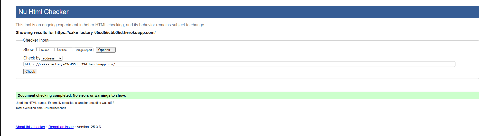

# Testing

The testing.md file provides a comprehensive overview of the testing process conducted for the project, ensuring that all features and functionalities are thoroughly evaluated for performance, usability, and compliance with best practices.

---

## HTML

Click to expand.

#### home.html
  
  

## CSS

Click to expand.

- I have included only one screenshot as all the pages are linked to the same CSS and all pages load the styles consistently as can be seen in the features.

## JAVASCRIPT

Click to expand.

- JShint
- Here I included all my javascript in one jshint validator image for testing. 

--- 

## PEP8

https://pep8ci.herokuapp.com

---

---

## Compatibilty 

The project has been tested for compatibility with the following browsers using this site. You will be able to see there are no issues with the compatability across these browsers:

Click to expand.

- Google Chrome (Version 124)

- Edge (Version 124)

- Firefox (Version 124)

- Safari (Version 17)

- iE (11)

---

## Accessibility

By utilising the Wave Accessibility tool for ongoing development and final testing, used for the below:

1. Ensure all forms have associated labels or appropriate aria-labels.
2. Validate that color contrasts meet the minimum ratios outlined in WCAG 2.1 Contrast Guidelines.
3. Verify correct heading levels to accurately convey content importance.
4. Confirm content is organized within landmarks for ease of use with assistive technology.
5. Provide alternative text or titles for non-textual content.
6. Set the HTML page lang attribute.
7. Implement Aria properties in adherence to best practices outlined in WCAG 2.1.
8. Follow established coding best practices for WCAG 2.1.

---

## Manual Testing 

| Function                      | User Action                                                                 | Outcome                                                                                               | Result |
|------------------------------|-----------------------------------------------------------------------------|------------------------------------------------------------------------------------------------------|--------|
| **Load Home Page**            | Access the Girls Get Tattoos link                                            | The homepage loads with an active navigation system, site branding, and products display.            | Pass   |
| **Load Signup Page**          | From the home page, click on the "Sign Up" link                              | The signup page loads with fields for username, email, password, and a submit button.                | Pass   |
| **Load Login Page**           | From the home page, click on the "Login" link                                | The login page loads with username, password fields and a submit button.                             | Pass   |
| **Browse Products**           | From the navigation, select "Products"                                       | The products page loads with a list of available products, each with an image, name, and price.       | Pass   |
| **View Product Details**      | Click on a product from the "Products" page                                  | The product detail page loads with more information, including a description, price, and images.     | Pass   |
| **Add Product to Bag**        | On the product detail page, click "Add to Bag"                               | The item is added to the shopping bag, and the bag icon in the navigation updates with the count.     | Pass   |
| **View Shopping Bag**         | From the navigation, click on the "Bag" icon                                 | The shopping bag page loads, showing added items with quantity and price details.                    | Pass   |
| **Update Quantity in Bag**    | On the shopping bag page, update the quantity of a product                  | The page refreshes, updating the product quantity and recalculating the total price.                 | Pass   |
| **Remove Product from Bag**   | On the shopping bag page, click the "Remove" button on a product            | The product is removed from the shopping bag, and the page is updated to reflect the change.         | Pass   |
| **Proceed to Checkout**       | On the shopping bag page, click "Proceed to Checkout"                        | The checkout page loads with fields for shipping details, payment options, and a review of the order. | Pass   |
| **Submit Order**              | On the checkout page, fill in the necessary details and submit the order     | The order is placed successfully, and the user is shown a confirmation page with order details.      | Pass   |
| **Contact Us Page**           | From the navigation, click on "Contact"                                      | The contact page loads with a form for users to fill out their name, email, and message.             | Pass   |
| **Consultations Page**        | From the navigation, click on "Consultations"                                | The consultations page loads, displaying available options for users to book a tattoo consultation.  | Pass   |
| **Submit Consultation Request**| On the consultation detail page, select a service and submit the form       | A success message is shown after submitting the consultation request.                                 | Pass   |
| **Forgot Password**           | On the login page, click "Forgot Password"                                   | The password reset page loads, allowing the user to input their email for a password reset.         | Pass   |
| **Login with Correct Credentials**| On the login page, enter correct username and password                  | The user is logged in successfully and redirected to the homepage or their account dashboard.         | Pass   |
| **Logout**                    | After logging in, click the "Logout" link in the navigation                  | The user is logged out and redirected to the login page.                                              | Pass   |
| **View Product in Bag**       | After adding a product to the bag, click on the bag icon                     | The bag icon updates with the product details and total price.                                        | Pass   |
| **View Account Profile**      | After logging in, click on the "Account" link in the navigation              | The user's profile page loads with their personal details, order history, and account settings.      | Pass   |
| **Update Account Details**    | On the profile page, update personal details and save                       | The updated details are saved successfully and displayed on the profile page.                        | Pass   |
| **View Order History**        | On the account profile page, click on "Order History"                        | The order history page loads, showing past orders with their details and statuses.                   | Pass   |

---

### Admin Management

| User Story | Requirement Met | Image |
| ---------- | ---------------- | ----- |
| As an admin, I want to manage products and consultations in the system so that I can keep the catalog up to date. | Yes |  |
| As an admin, I want to track customer purchases and consultations so that I can offer tailored services and recommendations. | Yes |  |
| As an admin, I want to manage user accounts (approve, deactivate) so that I maintain the security of the platform. | Yes |  |

### SEO & Marketing

| User Story | Requirement Met | Image |
| ---------- | ---------------- | ----- |
| As a user, I want to share tattoo designs and consultations on social media platforms like Instagram so that I can show my choices to friends. | Yes |  |
| As a marketer, I want to optimize the website's SEO using meta tags, sitemaps, and descriptions to ensure it ranks higher on search engines. | Yes |  |
| As a user, I want to subscribe to a newsletter so that I can receive updates about new tattoo designs and promotions. | Yes |  |

### Accessibility

| User Story | Requirement Met | Image |
| ---------- | ---------------- | ----- |
| As a user, I want to have sufficient contrast in visuals so that the website is easy to read under various lighting conditions. | Yes |  |
| As a user, I want the forms to have clear labels and instructions so that I can easily fill them out without confusion. | Yes |  |
| As a user, I want to receive clear error messages when I make mistakes while filling out forms. |	Yes	| Error messages are displayed near the relevant field with sufficient information on how to resolve the error. |
| As a user with visual impairments, I want to have all images described with alternative text, so I can understand their content. |	Yes	| All images have descriptive alt attributes, following the WCAG 2.1 guidelines for text alternatives.

### 404 Error and Custom Pages

| User Story | Requirement Met | Image |
| ---------- | ---------------- | ----- |
| As a user, I want to be shown a custom 404 error page if I navigate to a non-existing page so that my experience isn't disrupted with an unfriendly error. | Yes |  |
| As an admin, I want to update the content on the 404 error page to reflect the website's branding, offering users helpful links to explore other parts of the site. | Yes |  |

---

- Tested Across Different Browsers:
Tried the functionality on different browsers, but the issue persists.
Despite following all of the above debugging steps, the toast dismissal function still doesn’t work as expected.

Both of these issues have been thoroughly tested and debugged, but unfortunately, no changes have been achieved. I have discussed them with the community on Slack and have gone through the course walkthrough again, but the errors remain unresolved.

---

## Lighthouse Report
LightHouse is a web performance testing tool that can be used to evaluate the performance of a website. The report is generated by Google Chrome.

[Lighthouse Report](READMEmedia/lighthouse.png)

---

